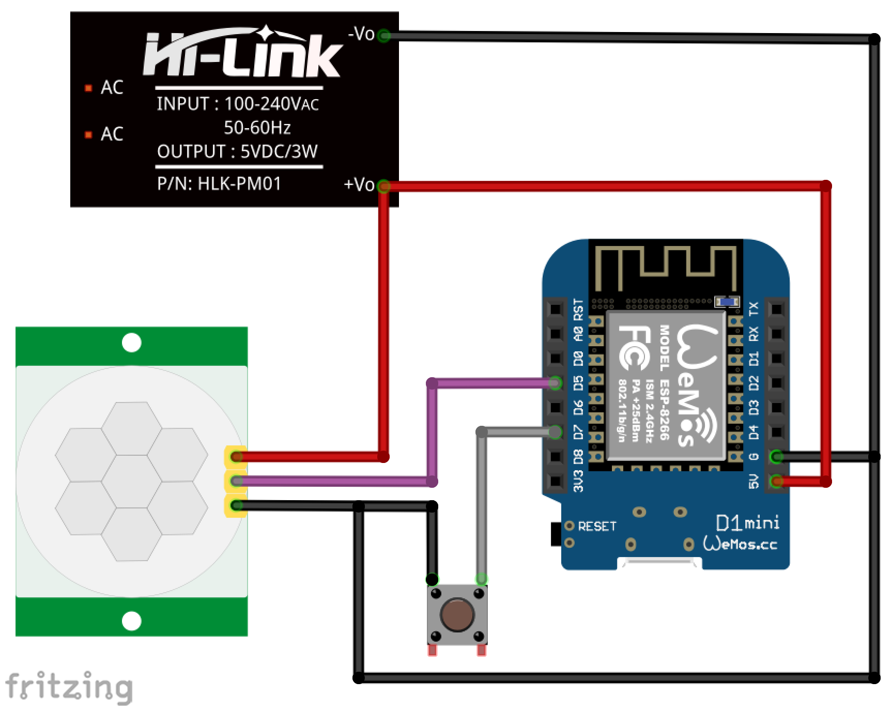

# Wemos D1 als PIR-Bewegungsmelder  

## Folgende Bauteile werden benötigt:
- Wemos D1 Mini
- 1 HC-SR501 PIR Bewegungsmelder
- 1 Taster (nicht dauerhaft, nur um bei erster Inbetriebnahme / Änderungen den Konfigurationsmodus zu starten)
- Stromversorgung (z.B. HLK-PM01)

## Flashen
Wenn alles nach obigem Bild verdrahtet wurde, kann das Image `WemosD1_HomeMatic_PIR.ino.d1_mini.bin` auf den Wemos geflasht werden.

#### Vorgehensweise:
1. Voraussetzungen:
  - CH340-Treiber installieren
  - [esptool](https://github.com/igrr/esptool-ck/releases) herunterladen
2. WemosD1 mit einem microUSB-Kabel an den PC anschließen
3. Bezeichnung des neuen COM-Ports im Gerätemanager notieren (z.B. COM5)
4. Flash-Vorgang durchführen: 

  `esptool.exe -vv -cd nodemcu -cb 921600 -cp COM5 -ca 0x00000 -cf WemosD1_HomeMatic_PIR.ino.d1_mini.bin`

## Voraussetzungen: 
- eine Systemvariable vom Typ "Logikwert". Bei der Benennung möglichst auf Umlaute verzichten!

## Konfiguration des Wemos D1
Um den Konfigurationsmodus zu starten, muss der Wemos D1 mit gedrückt gehaltenem Taster gestartet werden.
Die blaue LED blinkt kurz und leuchtet dann dauerhaft. 

Der Konfigurationsmodus ist nun aktiv.

Auf dem Handy oder Notebook sucht man nun nach neuen WLAN Netzen in der Umgebung. 

Es erscheint ein neues WLAN mit dem Namen "WemosD1-xx:xx:xx:xx:xx:xx"

Nachdem man sich mit diesem verbunden hat, öffnet sich automatisch das Konfigurationsportal.

Geschieht dies nicht nach ein paar Sekunden, ist im Browser die Seite http://192.168.4.1 aufzurufen.

**WLAN konfigurieren auswählen**

**SSID**: WLAN aus der Liste auswählen, oder SSID manuell eingeben

**WLAN-Key**: WLAN Passwort

**IP der CCU2**: selbsterklärend

**Name der Systemvariable**: Systemvariable, die in der CCU angelegt wurde

## PIR Bewegungsmelder einstellen:
Die Haltezeit und sowie die Empfindlichkeit können an den beiden Potentiometern eingestellt werden.
Eine Beschreibung lässt sich schnell bei Google finden, bzw. im [Datenblatt](https://www.mpja.com/download/31227sc.pdf) nachlesen.

# HINWEIS:
Zur eigenen Sicherheit sollte das Netzteil-Modul noch eine "Sicherheitsbeschaltung" bekommen, da gerade beim Einbau in geschlossenen Gehäusen/Unterputz die entstehende Wärme nicht ideal abgeleitet werden kann.

